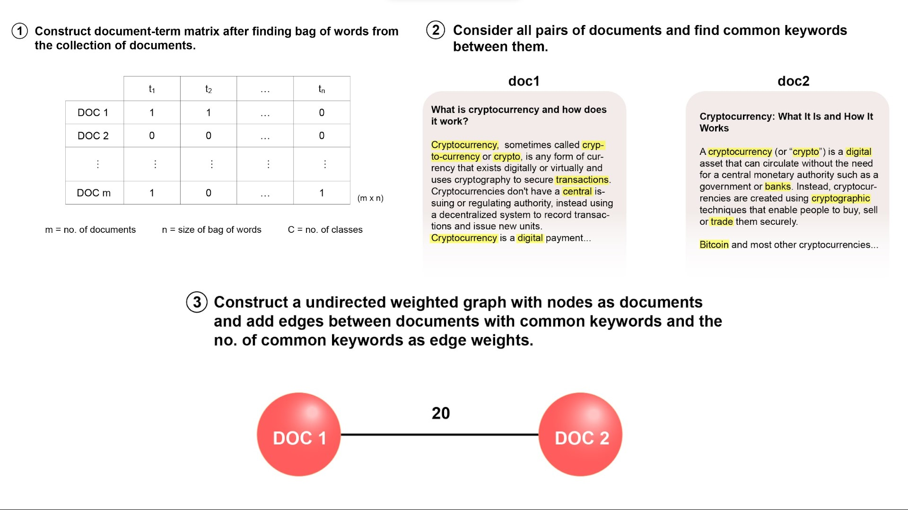
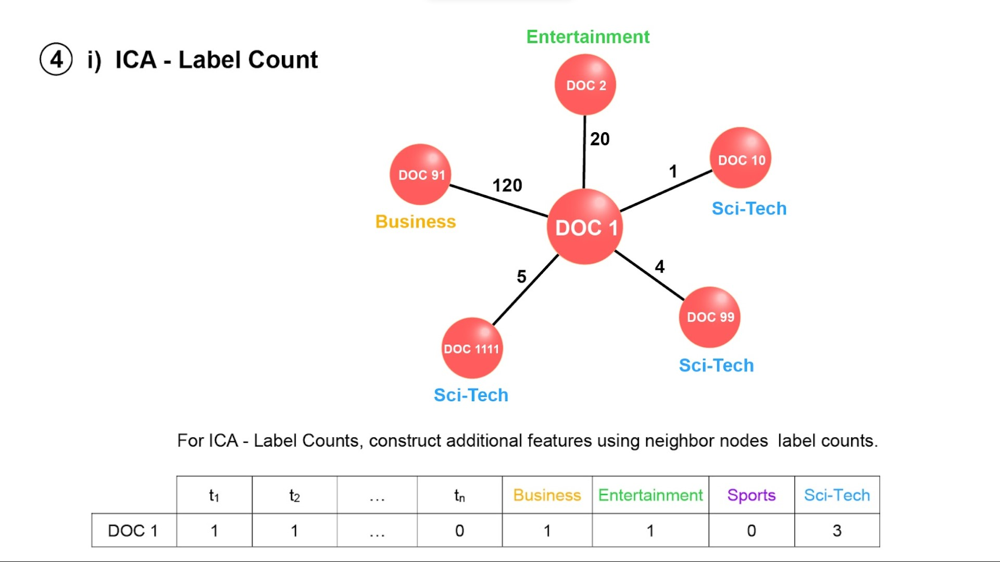
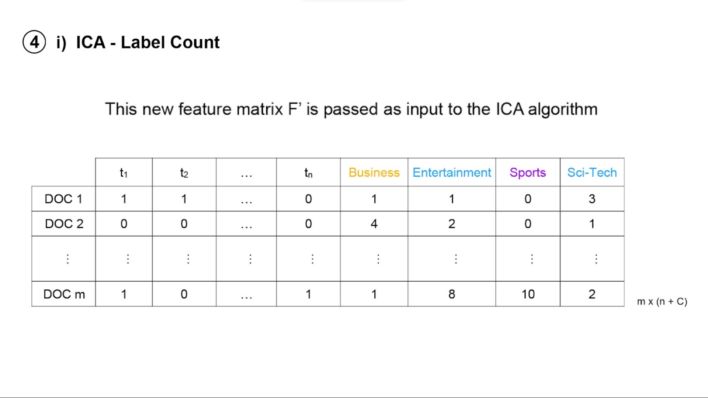
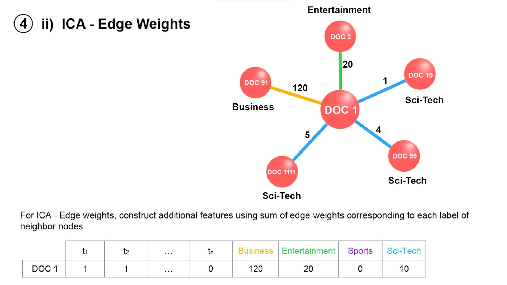
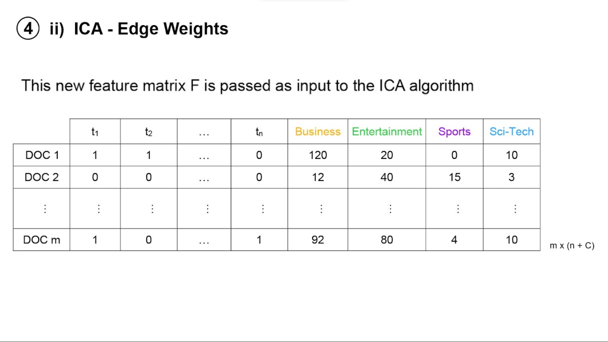
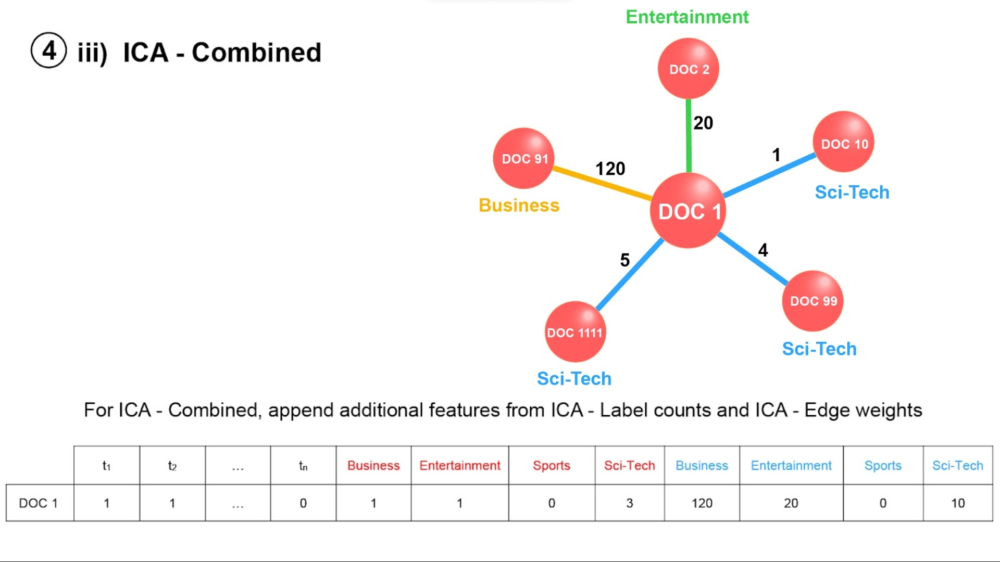
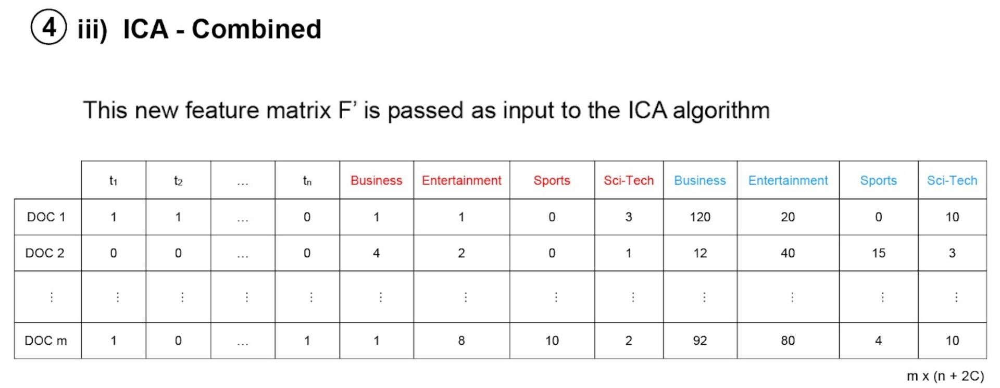

# Collective Classification Models For Data Without Explicit Linkage

This code base is a part of **"Collective Classification Models For Data Without Explicit Linkage"** paper, currently under peer-review for CODS-COMAD 2023.

## Overview of Dataset

We used a news articles dataset which had 17601 articles. The categories and their counts are as follows 

- Business (4440) 
- Entertainment (4236) 
- Science/Technology (5143) 
- Sports (3782) 

It is a multi-class prediction problem and the task is to predict the appropriate label for the articles. The feature matrix for this data set is composed of the keywords and phrases extracted from each document through the bag of words methodology. After the removal of stop-words, stemming, and lemmatization, the bag-of-words set contains 2700 keywords and phrases. The feature matrix obtained F is of the dimension 17601 X 2700. This dataset has no information about the hyperlinks between the news articles and an underlying graph of relationships does not exist.

## Install Dependencies

To install dependencies copy the commands below and paste in your conda prompt to install in your local conda environment.

    pip install numpy==1.21.2
    pip install pandas==1.3.5
    pip install networkx==2.6.3
    pip install sklearn==1.0.2
    pip install re==2.2.1
    pip install nltk==3.6.7
    pip install clean-text==0.5.0
    pip install csv==1.0

**Note:** If you are using a Jupyter/Colab notebook, add '!' before every pip install command and run it in a cell. For example, '!pip install clean-text==0.5.0'.

## Instructions

- Change all the file paths given in `Preprocessing.ipynb`, `Models/ICA`, `Models/Spectral Clustering` according to your local environment path. 

- Install all the dependencies mentioned above and run all the cells in `Preprocessing/Preprocessing.ipynb` file. Running all the cells will generate **`edge_list.csv`** (Contains edge list of graph used to create graph, which is input to the ICA and Spectral Clustering models),**`class_labels.npy`**(Contains ground-truth of all documents) and **`feature_matrix.npy`**(Contains feature matrix, input to ICA algorithm).

- Run all cells in notebooks from `Models/ICA` to obtain the results of Naive Bayes and ICA variants for different data distributions (Only data distribution i.e) random state value differs between `ICA_notebook_1`, `ICA_notebook_2` etc.).

- Run all cells in notebook from `Models/Spectral Clustering` to obtain the results of Spectral Clustering.
## ICA Variants

Below are the illustration of ICA Variants discussed in the paper.

## Resource Specifications

| Resource | Setting |
|----------|---------|
| RAM      | 16 GB   |
| CPU      | Intel(R) Core(TM) i7-8750H CPU @ 2.20GHz   2.21 GHz |
| System type | 64-bit operating system, x64-based processor |
| OS       | Windows 11 21H2    |    

## Acknowledgements

Thanks to [Praveen S](https://github.com/prvn-codes) for his illustrations.

## Contact

If you have any issues, reach out to [prasath.murugesan2001@gmail.com](mailto:prasath.murugesan2001@gmail.com) & [shamtcs@gmail.com](mailto:shamtcs@gmail.com).

